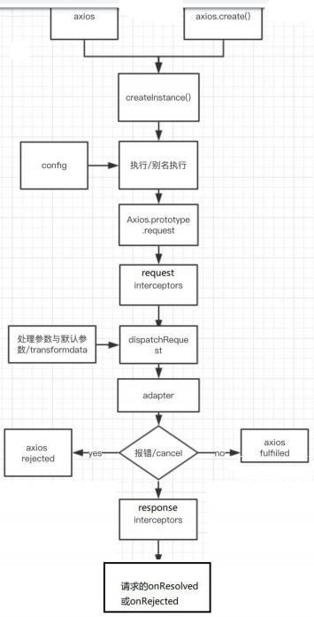
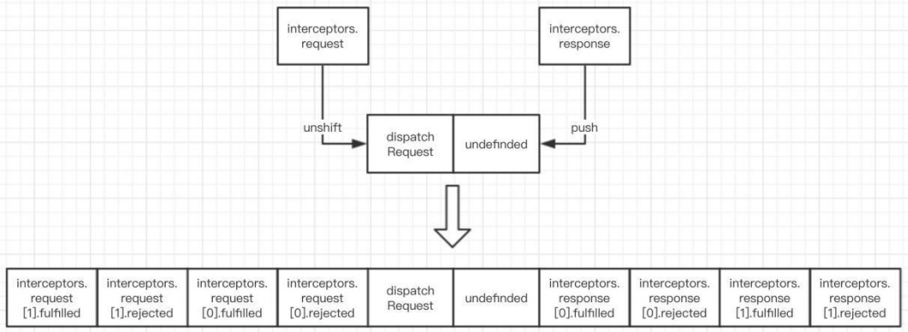

- [1. http](#1-http)
  - [1.1. http请求报文](#11-http%e8%af%b7%e6%b1%82%e6%8a%a5%e6%96%87)
  - [1.2. http响应报文](#12-http%e5%93%8d%e5%ba%94%e6%8a%a5%e6%96%87)
  - [1.3. 常见响应状态码](#13-%e5%b8%b8%e8%a7%81%e5%93%8d%e5%ba%94%e7%8a%b6%e6%80%81%e7%a0%81)
  - [1.4. 不同类型的请求及作用](#14-%e4%b8%8d%e5%90%8c%e7%b1%bb%e5%9e%8b%e7%9a%84%e8%af%b7%e6%b1%82%e5%8f%8a%e4%bd%9c%e7%94%a8)
  - [1.5. API的分类](#15-api%e7%9a%84%e5%88%86%e7%b1%bb)
- [2. 使用 json-server 搭建 REST API](#2-%e4%bd%bf%e7%94%a8-json-server-%e6%90%ad%e5%bb%ba-rest-api)
  - [2.1. JSON-SERVER](#21-json-server)
- [3. XHR的理解和使用](#3-xhr%e7%9a%84%e7%90%86%e8%a7%a3%e5%92%8c%e4%bd%bf%e7%94%a8)
  - [3.1. 理解](#31-%e7%90%86%e8%a7%a3)
  - [3.2. 区别一般 http 请求与 ajax 请求](#32-%e5%8c%ba%e5%88%ab%e4%b8%80%e8%88%ac-http-%e8%af%b7%e6%b1%82%e4%b8%8e-ajax-%e8%af%b7%e6%b1%82)
  - [3.3. API](#33-api)
- [4. XHR 的 ajax 封装(简单版 axios)](#4-xhr-%e7%9a%84-ajax-%e5%b0%81%e8%a3%85%e7%ae%80%e5%8d%95%e7%89%88-axios)
- [5. axios的理解和使用](#5-axios%e7%9a%84%e7%90%86%e8%a7%a3%e5%92%8c%e4%bd%bf%e7%94%a8)
  - [5.1. axios是什么](#51-axios%e6%98%af%e4%bb%80%e4%b9%88)
  - [5.2. axios特点](#52-axios%e7%89%b9%e7%82%b9)
  - [5.3. axios 常用语法](#53-axios-%e5%b8%b8%e7%94%a8%e8%af%ad%e6%b3%95)
- [6. aixos难点](#6-aixos%e9%9a%be%e7%82%b9)
  - [6.1. axios.create([config])](#61-axioscreateconfig)
  - [6.2. 拦截器函数/ajax 请求/请求的回调函数的调用顺序](#62-%e6%8b%a6%e6%88%aa%e5%99%a8%e5%87%bd%e6%95%b0ajax-%e8%af%b7%e6%b1%82%e8%af%b7%e6%b1%82%e7%9a%84%e5%9b%9e%e8%b0%83%e5%87%bd%e6%95%b0%e7%9a%84%e8%b0%83%e7%94%a8%e9%a1%ba%e5%ba%8f)
  - [6.3. 取消请求](#63-%e5%8f%96%e6%b6%88%e8%af%b7%e6%b1%82)
  - [response的整体结构](#response%e7%9a%84%e6%95%b4%e4%bd%93%e7%bb%93%e6%9e%84)
  - [erroe的整体结构](#erroe%e7%9a%84%e6%95%b4%e4%bd%93%e7%bb%93%e6%9e%84)
  - [如何取消未完成的请求?](#%e5%a6%82%e4%bd%95%e5%8f%96%e6%b6%88%e6%9c%aa%e5%ae%8c%e6%88%90%e7%9a%84%e8%af%b7%e6%b1%82)
# 1. http
MDN: https://developer.mozilla.org/zh-CN/docs/Web/HTTP/Overview
## 1.1. http请求报文
- 请求行： method: get/post url: /detail?id=2
- 请求头：host cookie content-type:application/x-www-form-urlencoded或者application/json
- 请求体： get没有请求体，post不带请求参数没有请求体，username=tom&pwd=123 {"username":"tom","pwd":123}
  + multipart/form-data 常用于文件上传请求
## 1.2. http响应报文
- 响应状态行： status statusText
- 多个响应头： 
  + content-type: text/html;charset=utf-8
  + set-cookie: BD_CK_SAM=1;path=/
- 响应体：html 文本/json 文本/js/css/图片

## 1.3. 常见响应状态码
- 100~199：表示成功接收请求，要求客户端继续提交下一次请求才能完成整个处理过程。
- 200~299：表示成功接收请求并已完成整个处理过程。常用200，请求成功，一般用于get/post请求，201已创建，成功请求并创建了新的资源
- 300~399：为完成请求，客户需进一步细化请求。例如：请求的资源已经移动一个新地址、常用302(意味着你请求我，我让你去找别人),307和304(我不给你这个资源，自己拿缓存)
- 400~499：客户端的请求有错误，常用404(意味着你请求的资源在web服务器中没有)403(服务器拒绝访问，权限不够)401(未授权，请求要求用户的身份验证)
- 500~599：服务器端出现错误，常用500

## 1.4. 不同类型的请求及作用
CRUD: Create-POST/Retrieve-GET/Update-PUT/Delete-DELETE
- GET：从服务器端<em>读</em>取数据
- POST：从服务器<em>增</em>新的数据。向指定资源提交数据进行处理请求（例如提交表单或者上传文件）。数据被包含在请求体中。POST请求可能会导致新的资源的创建和/或已有资源的修改。 
- PUT：<em>更新</em>服务器端已经存在的数据 
- DELETE：请求服务器<em>删除</em>Request-URI所标识的资源。 
- OPTIONS：返回服务器针对特定资源所支持的HTTP请求方法。也可以利用向Web服务器发送'*'的请求来测试服务器的功能性。 
- HEAD：向服务器索要与GET请求相一致的响应，只不过响应体将不会被返回。这一方法可以在不必传输整个响应内容的情况下，就可以获取包含在响应消息头中的元信息。
- TRACE：回显服务器收到的请求，主要用于测试或诊断。
- CONNECT：HTTP/1.1协议中预留给能够将连接改为管道方式的代理服务器。

## 1.5. API的分类
- REST API: restful
1. 发送请求进行 CRUD 哪个操作由请求方式来决定
2. 同一个请求路径可以进行多个操作
3. 请求方式会用到 GET/POST/PUT/DELETE
- 非 REST API: restless
1. 请求方式不决定请求的 CRUD 操作
2. 一个请求路径只对应一个操作
3. 一般只有 GET/POST

# 2. 使用 json-server 搭建 REST API
## 2.1. JSON-SERVER
用来快速搭建 REST API 的工具包
- https://github.com/typicode/json-server
- 编写db.json,cmd: json-server --watch db.json
- test: 01restAPI—CRUD.html
```js
  /* 1. GET请求: 从服务器端获取数据*/
  function testGet() {
    axios.get('http://localhost:3000/posts') // 获取所有posts的数组
    // axios.get('http://localhost:3000/posts/1') // 获取id为1的数组
    // axios.get('http://localhost:3000/posts?id=1&id=2') // 获取id为1或2的数组
    // axios.get('http://localhost:3000/posts?title=json-server&author=typicode')
  }
  
  /* 2. POST请求: 向服务器端添加新数据*/
  function testPost() {
    axios.post('http://localhost:3000/comments', {body: 'xxx', postId: 1}) // 保存数据
  }

  /* 3. PUT请求: 更新服务器端已经数据 */
  function testPut() {
    axios.put('http://localhost:3000/comments/2', {body: 'yyy', postId: 1})
  }

  /* 4. DELETE请求: 删除服务器端数据 */
  function testDelete() {
    axios.delete('http://localhost:3000/comments/2')
  }
```
# 3. XHR的理解和使用
MDN：https://developer.mozilla.org/zh-CN/docs/Web/API/XMLHttpRequest
## 3.1. 理解
- 使用 XMLHttpRequest (XHR)对象可以与服务器交互, 也就是发送 ajax 请求
- 前端可以获取到数据，而无需让整个的页面刷新。
- 这使得 Web 页面可以只更新页面的局部，而不影响用户的操作。
## 3.2. 区别一般 http 请求与 ajax 请求
- ajax 请求是一种特别的 http 请求
- 对服务器端来说, 没有任何区别, 区别在浏览器端的收发都不一样
- 浏览器端发请求: 只有 XHR 或 fetch 发出的才是 ajax 请求, 其它所有的都是
非 ajax 请求
- 浏览器端接收到响应
  + 一般请求: 浏览器一般会直接显示响应体数据, 也就是我们常说的刷新/
跳转页面
  + ajax 请求: 浏览器不会对界面进行任何更新操作, 只是调用监视的回调
函数并传入响应相关数据

## 3.3. API
1. XMLHttpRequest(): 创建 XHR 对象的构造函数
2. status: 响应状态码值, 比如 200, 404
3. statusText: 响应状态文本
4. readyState: 标识<em>请求状态</em>的只读属性
  - 0: 初始
  - 1: open()之后
  - 2: send()之后
  - 3: 请求中
  - 4: 请求完成
5. onreadystatechange: 监视的回调函数，绑定 readyState 改变的监听
6. responseType: 指定响应数据类型, 如果是’json’, 得到响应后自动解析响应体数据
7. response: 响应体内容, 类型取决于 responseType 的指定
8. timeout: 指定请求超时时间, 默认为 0 代表没有限制
9. ontimeout: 绑定超时的监听
10. onerror: 绑定请求网络错误的监听
11. open(): 初始化一个请求, 参数为: (method, url[, async])
12. send(data): 发送请求
13. abort(): 中断请求
14. getResponseHeader(name): 根据请求头的名字，获取指定的值
15. getAllResponseHeaders(): 获取所有响应头组成的字符串
16. setRequestHeader(name, value): 设置请求头

# 4. XHR 的 ajax 封装(简单版 axios)
- test: 02xhr.html
特点： 
- 函数的返回值为 promise, 成功的结果为 response, 失败的结果为 error
- 能处理多种类型的请求: GET/POST/PUT/DELETE
- 响应 json 数据自动解析为 js
- 函数的参数为一个配置对象
```js
{
	url: '', // 请求地址
	method: '', // 请求方式 GET/POST/PUT/DELETE
  params: {}, // GET/DELETE 请求的 query 参数
  data: {}, // POST 或 DELETE 请求的请求体参数
}
```

# 5. axios的理解和使用
## 5.1. axios是什么
- 前端最流行的 ajax 请求库
- react/vue 官方都推荐使用 axios 发 ajax 请求
- 文档: https://github.com/axios/axios
## 5.2. axios特点
- 基本 promise 的异步 ajax 请求库
- 浏览器端/node端都可以使用
- <em>支持请求／响应拦截器</em>
- 支持请求取消: axios.Cancel()/axios.CancelToken()/axios.isCancel()
- 请求/响应数据转换： axios.interceptors.request.use()/axios.interceptors.response.use()
- 批量发送多个请求，类似Promise.all(): axios.all(promises)
## 5.3. axios 常用语法
test: 03axios_CURD.html
- axios(config): 通用/最本质的发任意类型请求的方式
- axios(url[, config]): 可以只指定 url 发 get 请求
- axios.request(config): 等同于 axios(config)
- axios.get(url[, config]): 发 get 请求
- axios.delete(url[, config]): 发 delete 请求
- axios.post(url[, data, config]): 发 post 请求
- axios.put(url[, data, config]): 发 put 请求
+ axios.defaults.xxx=: 请求的默认全局配置
+ axios.interceptors.request.use(): 添加请求拦截器
+ axios.interceptors.response.use(): 添加响应拦截器
- axios.create([config]): 创建一个新的 axios(它没有下面的功能),返回的是函数
+ axios.Cancel(): 用于创建取消请求的错误对象
+ axios.CancelToken(): 用于创建取消请求的 token 对象
+ axios.isCancel(): 是否是一个取消请求的错误
+ axios.all(promises): 用于批量执行多个异步请求
+ axios.spread(): 用来指定接收所有成功数据的回调函数的方法

# 6. aixos难点
## 6.1. axios.create([config])
- 根据指定配置创建一个新的 axios, 也就就每个新 axios 都有自己的配置
- 新 axios 只是没有取消请求和批量发请求的方法, 其它所有语法都是一致的
- 为什么要设计这个语法?
1.  需求: 项目中有部分接口需要的配置与另一部分接口需要的配置不太一
样, 如何处理
2.  解决: 创建 2 个新 axios, 每个都有自己特有的配置, 分别应用到不同要
求的接口请求中
```js 
  // 第一个axios
  axios.defaults.baseURL = 'http://localhost:4000'
  axios({
    url: '/xxx'
  })
  // 第二个aixos
  const instance = axios.create({
    baseURL: 'http://localhost:3000'
  })
  //  使用instance发请求
  instance({
    url: '/posts',
    method: 'GET'
  })
  // instance.get('/posts')
```
## 6.2. 拦截器函数/ajax 请求/请求的回调函数的调用顺序
- 多个axios请求，有相同的处理和不同的处理，相同的处理交给拦截器
- : 调用 axios()并不是立即发送 ajax 请求, 而是需要经历一个较长的流程
- 流程: 请求拦截器2 => 请求拦截器 1 => 发ajax请求 => 响应拦截器1 => 响
应拦截器 2 => 请求的回调
- 注意: 此流程是通过 promise 串连起来的, 请求拦截器传递的是 config, 响应
- 拦截器传递的是 response
```js
  //  添加请求拦截器(回调函数)
  axios.interceptors.request.use(
    config => {
      console.log("request interceptor1 onResolved()")
      return config // 不返回，会报错error Cannot read property 'cancelToken' of undefined
    },
    error => {
      console.log("request interceptor1 onRejected()")
      return Promise.reject(error)
    }
  )
  
  axios.interceptors.request.use(
    config => {
      console.log("request interceptor2 onResolved()")
       return config
    },
    error => {
      console.log("request interceptor2 onRejected()")
      return Promise.reject(error)
    }
  )
  // 添加响应拦截器
  axios.interceptors.response.use(
    response => {
      console.log("response interceptor1 onResolved()")
      return response //不返回，会报error Cannot read property 'data' of undefined,因为没有返回则返回undefined，undefined会一值传递下去undefined.data没有data这个属性
    },
    error => {
      console.log("response interceptor1 onRejected()")
      return Promise.reject(error)
    }
  )
  axios.interceptors.response.use(
    response => {
      console.log("response interceptor2 onResolved()")
      return response
    },
    error => {
      console.log("response interceptor2 onRejected()")
      return Promise.reject(error)
    }
  )
  axios.get('http://localhost:3000/posts')
    .then(response => { console.log("data", response.data)})
    .catch(error => {console.log("error", error.message)})
  /*
  request interceptor2 onResolved()
  request interceptor1 onResolved()
  response interceptor1 onResolved()
  response interceptor2 onResolved()
  data Array(5)
  */
```

## 6.3. 取消请求
1. 基本流程
- 配置 cancelToken 对象
- 缓存用于取消请求的 cancel 函数
- 在后面特定时机调用 cancel 函数取消请求
- 在错误回调中判断如果 error 是 cancel, 做相应处理
需求一： 点击按钮, 取消某个正在请求中的请求
``html
<body>
  <button onclick="getProducts1()">获取商品列表1</button><br>
  <button onclick="getProducts2()">获取商品列表2</button><br>
  <button onclick="cancelReq()">取消请求</button><br>
  <script src="https://cdn.bootcss.com/axios/0.19.0/axios.js"></script>
  <script>
let cancel  // 用于保存取消请求的函数
function getProducts1() {
  axios({
    url: 'http://localhost:4000/products1',
    cancelToken: new axios.CancelToken((c) => { // c是用于取消当前请求的函数
      // 保存cancel函数, 用于之后可能需要取消当前请求
      cancel = c
    })
  }).then( // 已经请求成功了，因此无论是响应成功还是失败，都将cancel函数置null
    response => {
      cancel = null
      console.log('请求1成功了', response.data)
    },
    error => { // 若在请求过程中中断请求，.then()会返回特殊的error，这个error是一个axios的cancel对象，而不是平时由于路径错误等返回的error
      cancel = null
      console.log('请求1失败了', error.message, error)
    }
  )
}
function getProducts2() {
  axios({
    url: 'http://localhost:4000/products2'
  }).then(
    response => {
      console.log('请求2成功了', response.data)
    },
    error => {
      cancel = null
      console.log('请求2失败了', error.message)
    }
  )
}
function cancelReq() {
  // alert('取消请求')
  // 执行取消请求的函数
  if (typeof cancel === 'function') { // 先判断是不是一个函数
    cancel('强制取消请求')
  } else {
    console.log('没有可取消的请求')
  }
}
</script>
</body>
```
需求2：在发送一个请求B前，如果前一个请求A还没完成，先取消A，再发送请求B（未使用拦截器）

```js
let cancel  // 用于保存取消请求的函数
function getProducts1() {
  // 在准备发请求前, 取消未完成的请求
  if (typeof cancel === 'function') {
    cancel('取消请求')
  }

  axios({
    url: 'http://localhost:4000/products1',
    cancelToken: new axios.CancelToken((c) => { // c是用于取消当前请求的函数
      // 保存取消函数, 用于之后可能需要取消当前请求
      cancel = c
      })
    }).then(
      response => {
      cancel = null
      console.log('请求1成功了', response.data)
    },
      error => {
        if (axios.isCancel(error)) {
          // cancel = null
          console.log('请求1取消的错误', error.message)
        } else { // 请求出错了
          cancel = null
          console.log('请求1失败了', error.message)
        }
      }
    )
}
function getProducts2() {
  // 在准备发请求前, 取消未完成的请求
  if (typeof cancel === 'function') {
    cancel('取消请求')
  }
  axios({
    url: 'http://localhost:4000/products2',
    cancelToken: new axios.CancelToken((c) => { // c是用于取消当前请求的函数
      // 保存取消函数, 用于之后可能需要取消当前请求
      cancel = c
    })
  }).then(
    response => {
      cancel = null
      console.log('请求2成功了', response.data)
    },
    error => {
      if (axios.isCancel(error)) {
        // cancel = null
        console.log('请求2取消的错误', error.message)
      } else { // 请求出错了
        cancel = null
        console.log('请求2失败了', error.message)
      }
    }
  )
}

function cancelReq() {
  // alert('取消请求')
  // 执行取消请求的函数
  if (typeof cancel === 'function') {
    cancel('强制取消请求')
  } else {
    console.log('没有可取消的请求')
  }
}
```
需求2：在发送一个请求B前，如果前一个请求A还没完成，先取消A，再发送请求B（使用拦截器）
```js
let cancel // 用于保存取消请求的的函数
// 添加请求拦截器
axios.interceptors.request.use((config) => {
    // 在准备发请求前, 取消未完成的请求
  if (typeof cancel === 'function') {
    cancel('取消请求')
  }
  // 添加一个cancelToken的配置
  config.cancelToken = new axios.CancelToken((c) => {
    // 保存取消函数，用于之后可能取消当前需求
    cancel = c
  })
  return config
})
// 添加响应拦截器
axios.interceptors.response.use((config) => {
  response => {
    cancel = null
    return response
  },
  error => {
    if (axios.isCancel(error)) { // 取消请求的error统一处理
      console.log("这是取消请求的错误",error)
      // 中断Promise链
      return new Promise(() => {})
    } else { // 平时由于路径错误等返回的error，将这种error传递下去各个请求各自处理
      // throw error
      return Promise.reject(error)
    }
  }
})

function getProducts1() {
  axios({
    url: 'http://localhost:4000/products1',
  }).then(
    response => {
      console.log('请求1成功了', response.data)
    },
    error => {
        console.log('请求1失败了', error.message)
    })
}
function getProducts2() {
  axios({
    url: 'http://localhost:4000/products2',
  }).then(
    response => {
      console.log('请求2成功了', response.data)
    },
    error => {
      console.log('请求2失败了', error.message)
    })
}
```

# axios源码
- 官方库：https://github.com/axios/axios
- 含中文注释的axios库：https://github.com/cheungww/axios
## axios源码目录
- ├── /dist/                     # 项目输出目录
- ├── /lib/                      # 项目源码目录
- │ ├── /adapters/               # 定义请求的适配器 xhr、http
- │ │ ├── http.js                # 实现http适配器(包装http包)
- │ │ └── xhr.js                 # 实现xhr适配器(包装xhr对象)
- │ ├── /cancel/                 # 定义取消功能
- │ ├── /core/                   # 一些核心功能
- │ │ ├── Axios.js               # axios的核心主类
- │ │ ├── dispatchRequest.js     # 用来调用http请求适配器方法发送请求的函数
- │ │ ├── InterceptorManager.js  # 拦截器的管理器
- │ │ └── settle.js              # 根据http响应状态，改变Promise的状态
- │ ├── /helpers/                # 一些辅助方法
- │ ├── axios.js                 # 对外暴露接口
- │ ├── defaults.js              # axios的默认配置 
- │ └── utils.js                 # 公用工具
- ├── package.json               # 项目信息
- ├── index.d.ts                 # 配置TypeScript的声明文件
- └── index.js                   # 入口文件
## axios源码分析
## axios 与 Axios 的关系?
1. 从语法上来说: axios 不是 Axios 的实例--》 axios 是 Axios.prototype.request 函数 bind()返回的函数，axios()可以作为函数发请求，但是Axios实例不可以，只能调用方法才能发请求，如Axios.get()/Axios.post()
2. 从功能上来说: axios 是 Axios 的实例--》 axios 作为对象,它有 Axios 原型对象上的所有方法, 有 Axios 对象上所有属性

## instance 与 axios 的区别?
- 相同:
1. 都是一个能发任意请求的函数: request(config)
2. 都有发特定请求的各种方法: get()/post()/put()/delete()
3. 都有默认配置和拦截器的属性: defaults/interceptors
- 不同:
1. 默认匹配的值很可能不一样，各自默认配置和拦截器的配置可能不一样
2. instance 没有 axios 后面添加的一些方法: create()/CancelToken()/all()

## axios 运行的整体流程（将这三个函数提出来，他们各自的作用和相互之间的关系）
- 整体流程: request(config) ==> dispatchRequest(config) ==> xhrAdapter(config)

```js
/*
let chain = [dispatchRequest, undefined]
requestInterceptors: [{fulfilled1(){}, rejected1(){}}, {fulfilled2(){}, rejected2(){}}]
responseInterceptors: [{fulfilled11(){}, rejected11(){}}, {fulfilled22(){}, rejected22(){}}]
后添加的请求拦截器先执行 =》请求拦截器以unshift()方式添加到chain的前面
响应拦截器以push()添加到chain的后面
chain: [fulfilled2, rejected2, fulfilled1, rejeted1,
        dispatchRequest, undefined,
        fulfilled11, rejected11, fulfilled2, rejectd2]

promise链回调：
while(chain.length) {
  promise.length = {
    promise = promise.length(chain.shift(), chain.shift())
  }
}
return promise
效果就是：
config => (fulfilled2, rejected2) => (fulfilled1, rejeted1) // 请求拦截处理
       => (dispatchRequest, undefined) // 发请求
       => (fulfilled11, rejected11) => (fulfilled2, rejectd2) // 响应拦截处理
       => (onResolved, onRejected) // axois发请求回调处理
*/
```
1. request(config): 将请求拦截器 / dispatchRequest() / 响应拦截器 通过 promise 链<em>串连</em>起来, 返回 promise

2. dispatchRequest(config): <em>主要转换请求体数据和响应体数据</em>，转换请求数据 ==> 调用 xhrAdapter()发请求 ==> 请求返回后转换响应数
据. 返回 promise

3. xhrAdapter(config): <em>创建 XHR 对象</em>, 根据 config 进行相应设置, 发送特定请求, 并接收响应数据, 返回 promise
## axios 的请求/响应拦截器是什么?

- 请求拦截器:
1. 在真正发送请求前执行的回调函数
2. 可以对请求进行检查或配置进行特定处理
3. 成功的回调函数, 传递的默认是 config(也必须是)
4. 失败的回调函数, 传递的默认是 error

- 响应拦截器
1. 在请求得到响应后执行的回调函数
2. 可以对响应数据进行特定处理
3. 成功的回调函数, 传递的默认是 response
4. 失败的回调函数, 传递的默认是 error
## axios 的请求/响应数据转换器是什么?
1. 请求转换器: 对请求头和请求体数据进行特定处理的函数
```js
if (utils.isObject(data)) {
  setContentTypeIfUnset(headers,'application/json;charset=utf-8');
  return JSON.stringify(data);
}
```
2. 响应转换器: 将响应体 json 字符串解析为 js 对象或数组的函数
response.data = JSON.parse(response.data)
## response的整体结构
{data, status, statusText, headers, config, request}
## erroe的整体结构
{message, response, request}
## 如何取消未完成的请求?
有两个Promise,一个是发axios请求的promise,一个是取消发请求的Promise;<br>
有两个cancel,一个Cancel对象，一个cancel()函数
- 当配置了 cancelToken 对象时, 保存 cancel 函数
1. 创建一个用于将来中断请求的 cancelPromise
2. 并定义了一个用于取消请求的 cancel 函数
3. 对于发axios请求来说，cancel是失败reject的reason；对于保存cancelPromis来说，cancel是成功resolve的value
4. 将 cancel 函数传递出来
- 调用cancel()取消请求
1. 执行 cacel 函数, 传入错误信息 message
2. 内部会让 cancelPromise 变为成功, 且成功的值为一个 Cancel 对象--》cancel('a') resolve(new Cancel('a'))
3. 在 cancelPromise 的成功回调中最终实现中断请求, 并让发axios请求的proimse 失败, 失败的 reason 为 Cacel 对象